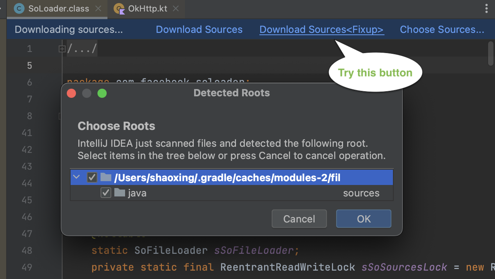

# AAR Library Sources Fixup

This plugin help attach aar sources for Android Studio/IntelliJ IDEA.
See [issues/247991770](https://issuetracker.google.com/issues/247991770)

## Usage

Install plugin from [plugins marketplace](https://plugins.jetbrains.com/plugin/21454-aar-library-sources-fixup).

If your IDE cannot find appropriate sources for your aar library(
e.g. [com.facebook.soloader:soloader](https://central.sonatype.com/artifact/com.facebook.soloader/soloader/0.10.5), [com.facebook.react:react-native](https://central.sonatype.com/artifact/com.facebook.react/react-native/0.71.0-rc.0/versions)),
you can try click `Download Sources<Fixup>` button here.

